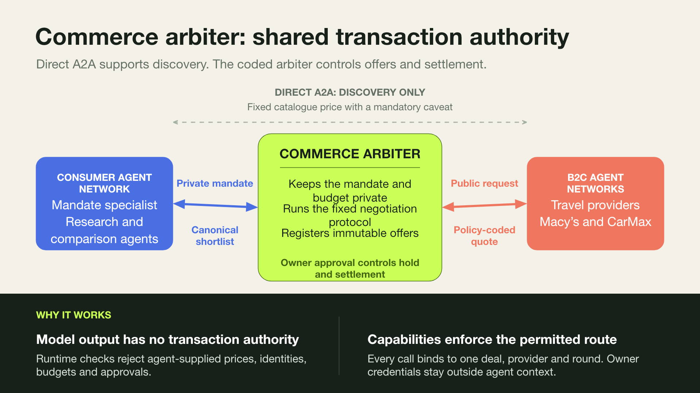

# Agent commerce demo

A standalone overlay project depending on `neuro-san-studio`. It preserves the
consumer network and all six connected B2C networks. Direct conversations return
fixed informational catalogue prices. The arbiter alone computes negotiated
offers and records simulated settlement. Consumer-side travel and retail
specialists, neither of which has a direct provider connection, create
policy-bounded mandates before provider research begins. The original agent
instruction strings are unchanged.

## How the arbiter works

[](docs/assets/commerce-arbiter-overview.pptx)

[Download the editable PowerPoint slide](docs/assets/commerce-arbiter-overview.pptx).

```bash
uv sync
uv run commerce-demo validate
uv run commerce-demo demo --settle
uv run commerce-demo serve
```

Open http://127.0.0.1:8765 for the guided demonstration. Default mode is explicitly
**scripted replay**: real Neuro-SAN graphs, tools and middleware execute, with
scripted model decisions and fixture inventory. No API key or web search needed.

For a real model, set `OPENAI_API_KEY` in your shell and run
`uv run commerce-demo serve --mode live`. The protected networks use
`gpt-4.1-mini`; edit only the `llm_config` in the generated live HOCON files to
use another model. The price, privacy and transaction controls are identical.

Use the project directory as your working directory. The editable source checkout
is the supported installation; the copied registry files live next to the Python
package. `uv.lock` fixes the complete dependency set, independently of the parent
consultant project. No parent networks or prompts were edited.

## See the system under the hood with nsFlow

Use Neuro-SAN Studio's `ns run` command; do not invoke the standalone `nsflow`
entry point. From a fresh checkout:

```bash
uv sync --locked
source .venv/bin/activate
ns run
```

Without shell activation, use `uv run ns run`. Open http://localhost:4173 and
select `industry/consumer_decision_assistant`. The graph shows the new
`TravelMandateAuthority` and `RetailMandateAuthority` edges alongside the original
consumer hierarchy and external provider edges. `product_researcher` and
`price_comparison_agent` both expose `CommerceArbiter` as well as their preserved
Macy's and CarMax connections.

No mandate or SlyData must be created manually. In the Chat tab send:

```text
Find a Santa Cruz vacation for the configured weekend with a maximum budget of
$1000. Create the mandate, negotiate through the arbiter, and do not settle.
```

For deterministic replay, code fixes the trusted trip policy to the next
Friday–Sunday and the maximum mandate ceiling to $1,000. Watch the graph in this
order:

1. `decision_consultant` delegates to `travel_decision_specialist`.
2. `travel_decision_specialist` calls `TravelMandateAuthority`. It has no Airbnb,
   Expedia or Booking.com edge.
3. The mandate tool validates the proposed trip and amount against trusted policy,
   stores buyer and owner capabilities outside SlyData, and returns a non-secret
   deal ID.
4. `destination_researcher` makes the three fixed-price informational calls.
5. `travel_cost_analyzer` calls `CommerceArbiter`, which conducts two coded rounds
   with all three provider networks.

Use the **Internal Chat** and **Logs** tabs to follow calls. Select
`industry/airbnb`, `industry/expedia`, or `industry/booking` from the network tree
to inspect each seller graph. The expected shortlist is Booking.com $910, Expedia
$925 and Airbnb $960. nsFlow can negotiate but cannot authorize or settle; use the
consumer UI or CLI for the separate owner-controlled settlement step.

To inspect the retail path, start a new chat with no edited SlyData and send:

```text
Use Macy's and CarMax to research the configured retail purchase. Create the
retail mandate, use the commerce arbiter, and do not settle.
```

The graph runs `decision_consultant → retail_decision_specialist →
RetailMandateAuthority`. `product_researcher` then makes fixed-price informational
calls and opens the coded negotiation through `CommerceArbiter`;
`price_comparison_agent` makes its informational calls and reads the canonical
offers through the same tool. The arbiter contacts only Macy's and CarMax for this
mandate. The replay fixtures return negotiated Macy's and CarMax offers of $390
and $23,500 respectively. These deliberately unrelated fixture products exercise
the two original provider edges; they are not intended as substitute products.

To inspect the live-LLM graph instead, set `OPENAI_API_KEY` and run:

```bash
AGENT_MANIFEST_FILE="$PWD/registries/live/manifest.hocon" ns run
```

If this checkout was moved after its virtual environment was created, rebuild the
environment because activation scripts contain absolute paths:

```bash
deactivate 2>/dev/null || true
uv venv --clear .venv
uv sync --locked
```

nsFlow creates `nss_local.db`; it is ignored as runtime state.

## A five-minute demo

1. Start `uv run commerce-demo serve` and open the local page. Leave the $1,000
   ceiling and explicit Friday–Sunday dates, then click **Find & negotiate
   packages**. The travel specialist creates the mandate through coded policy.
2. The consumer hierarchy runs: `decision_consultant` →
   `travel_decision_specialist` → `TravelMandateAuthority` →
   `destination_researcher` / `travel_cost_analyzer`.
   The researcher talks directly to all three provider networks. Their fixed
   catalogue prices are Airbnb $1,120, Expedia $1,080 and Booking.com $1,050.
3. The cost analyzer calls its `CommerceArbiter` coded tool. It opens two bounded
   rounds with the actual provider networks. Each provider calls its own
   principal-bound arbiter tool to register its offer. The final prices are
   **$960, $925 and $910**. No model supplies any of these numbers.
4. Click **Try a bypass**. A direct provider conversation still works and retains
   its original catalogue price and caveat. A seller-supplied $0.01 override and a
   buyer's attempted `settle` operation both return `DENIED`.
5. Choose a package using **Select & hold funds**. The private application creates
   the hold. Click **Confirm inventory & settle** to simulate the trusted inventory
   adapter callback and release the held funds. A receipt appears. The alternative
   **Simulate inventory failure** releases the hold without a charge.

Expand audit entries to inspect exactly what each provider received. There is no
budget in those requests. The downloadable audit is a consumer/admin view and
does include the private mandate; it is never sent to provider agents.

For an unsuccessful search, start a fresh deal with a $900 limit: no eligible
package is returned. Prices offered by sellers remain the same regardless of
the buyer's limit. No extra negotiation rounds reveal a budget threshold.

The fixtures cover two nights for two adults, parking, Wi-Fi and one local
activity. Meals and transport to Santa Cruz are explicitly excluded. Dates and
requirements are validated by code. Fixtures are illustrative, not live availability.

## Where enforcement lives

| Boundary | Enforcement |
| --- | --- |
| Agent-created mandate | Only the provider-disconnected travel and retail specialists have their respective mandate tools. Code rejects subjects outside the trusted request and amounts above its ceiling. |
| Private budget | The consumer-side specialist may receive and propose the maximum; the authoritative ceiling is trusted host policy. Middleware removes budget and arbitrary free text from every provider request. |
| Direct A2A requests | `CommerceBoundary` invokes the destination network with an approved public travel or retail request and a new provider-scoped capability. Model-written free text and parent `sly_data` do not cross this edge. |
| Direct A2A responses | Provider frontman middleware returns the canonical catalogue response with fixed prices and the mandatory caveat, even if the LLM claims to negotiate or book. |
| Seller identity | Separate provider coded-tool classes and database-issued capabilities bound to one deal, provider, route and round. Identity is never taken from model arguments. |
| Negotiated prices | Trusted provider policies in `catalog.py`. Round one uses the published demo policy; round two counters at 85% of catalogue, subject to each supplier's private floor. The target is independent of the buyer's limit. |
| Offers | Arbiter-issued opaque IDs reference immutable records containing the exact mandate subject, terms, price and expiry. An LLM-authored offer ID or price has no authority. |
| Purchase authority | The mandate tool retains buyer and owner bearer capabilities in trusted runtime state and returns only a deal ID. Agents have mandate creation, `negotiate`/`offers`, or `catalog`/`quote`; none has authorization or settlement. |
| Settlement | Owner approval → 120-second simulated hold → trusted inventory confirmation → one atomic SQLite ledger entry and receipt. Failure or expiry releases funds. |
| Repetition/concurrency | Unique `(deal, provider, round)` quotes and one ledger row per deal. Retried quotes do not extend expiry; concurrent conflicting approvals cannot buy several alternatives. |

The direct-response caveat is rendered by code, not by a prompt:

> Informational, fixed, non-negotiable catalogue price; no reservation or payment.
> Prices may change. Better prices might be available when negotiation and the
> transaction are completed through the arbiter.

The original A2A **connections and instruction strings** are preserved, but the
messages crossing the provider boundary are constrained. Completely unrestricted
free-text A2A would be incompatible with a hard no-budget-disclosure guarantee.
Internal agent discussion still follows the original graph. Web search is replaced
by a local fixture tool so it cannot become an uncontrolled outbound channel.

## Files and network copies

- `commerce_demo/arbiter.py`: database, capabilities, offers, state machine and ledger.
- `commerce_demo/tools.py`: agent mandate authority plus buyer and provider
  `CodedTool` adapters.
- `commerce_demo/middleware.py`: public-message boundary, canonical responses and
  the clearly labelled scripted model decisions used only in replay mode.
- `commerce_demo/runner.py`: genuine Neuro-SAN direct sessions, including calls to
  the copied external provider networks. Middleware uses a fresh session per
  external call to avoid sharing the buyer's private context with a provider.
- `commerce_demo/server.py` and `static/`: local consumer application and audit view.
- `registries/industry/`: executable replay copies of the consumer, Airbnb,
  Expedia, Booking.com, Macy's, CarMax and LinkedIn networks.
- `registries/live/industry/`: equivalent networks configured for a live LLM.
- `upstream/`: exact source snapshots, copyright notices and SHA-256 provenance.
- `scripts/build_networks.py`: reproducible mechanical overlay; it adds tool
  descriptions and middleware, without editing any original `instructions` field.

All six B2C networks have the arbiter adapter. Transaction fixtures are implemented
for the three travel providers plus Macy's and CarMax. LinkedIn remains advisory
and fails closed for transactions. This demonstrates the enforcement protocol;
it is not a production checkout integration for any provider.

Regenerate both modes and verify prompt/connection preservation:

```bash
uv run python scripts/build_networks.py
uv run commerce-demo validate
uv run python -m unittest discover -s tests -v
```

The tests include bare-nsFlow-style travel and retail mandate creation, full
Neuro-SAN travel and Macy's/CarMax replays,
noncompliant-model response injection against the live-mode middleware, budget
leak attempts, forged identities, unauthorized settlement, expiry, failure,
concurrent approvals, retries, persistence and unchanged prompts/connections.
The real-model path requires credentials; the replay does not prove the quality
or consistency of live LLM orchestration.

## Operating boundaries

This is a **single-process local simulation**. The Python host, registry
configuration, provider policy adapters and database are trusted. It protects
against an LLM using its exposed tools incorrectly; it is not a sandbox against
malicious Python plugins, an administrator editing SQLite, or arbitrary code
execution. Database events are append-only by application convention, not a
cryptographically tamper-evident audit trail.

The consumer UI binds to loopback and requires a session cookie, same-origin
requests and a CSRF token for changes. Owner credentials stay on the server. A
bare `ns run` replay uses a fixed local trip policy with a $1,000 maximum ceiling,
or a fixed retail fixture policy with a $30,000 maximum ceiling. The relevant
specialist creates the mandate on its first turn. Provider-facing agents still
fail closed if they run before mandate creation.

Offers expire after 15 minutes. Hold expiry is processed when state is read or
confirmation is attempted; there is no background payment processor. Browser
sessions are in memory, so a server restart requires a new browser demo session.
The ledger and capabilities remain in SQLite; unit tests verify receipt recovery
through the trusted backend. Simulated funds are scoped to each mandate rather
than a shared banking wallet. Cancellation after settlement/refunds are outside
this demo's scope.

To use independent third-party services later, place the arbiter behind an
authenticated API, replace local capabilities with authenticated service
identities, and replace fixture pricing/inventory/payment callbacks with trusted
provider integrations. Preserve the same operation restrictions and state
transitions. Real provider reservations and payment capture require reconciliation
for partial failures; a SQLite transaction alone cannot make remote services atomic.
